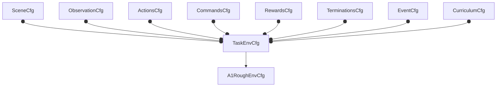
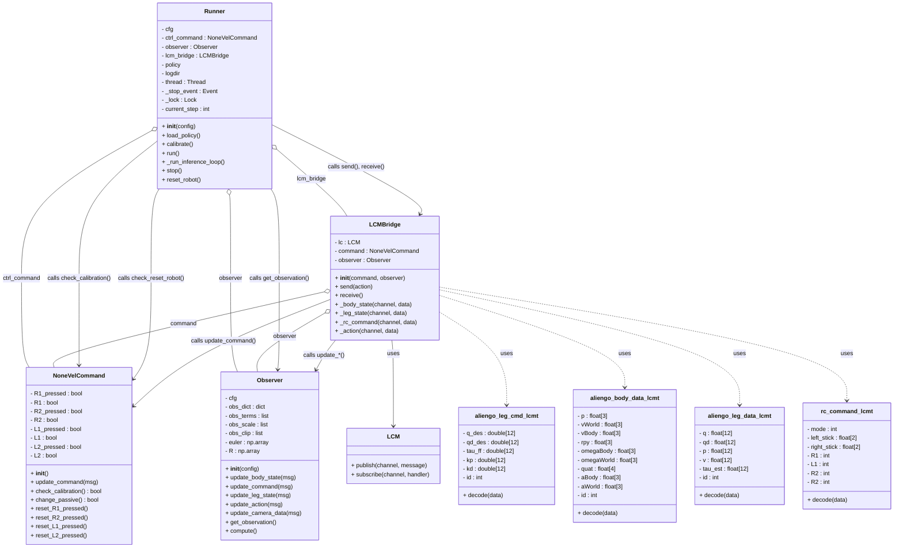

- [Training](#training)
  - [Env Configurations](#env-configurations)
  - [Add a New Robot](#add-a-new-robot)
  - [Call The Env](#call-the-env)
  - [Agent Configurations](#agent-configurations)
  - [Configuration Output](#configuration-output)
  - [Test File](#test-file)
  - [How does training work](#how-does-training-work)
- [Deployment](#deployment)
  - [SDK](#sdk)
  - [LCM Data Types](#lcm-data-types)
  - [Others](#others)

# Training

## Env Configurations

The environment is bound to a task, meaning each task corresponds to a specific scene. In IsaacLab's source code, there is an `extensions` folder with three main components: `omni.isaac.lab`, `omni.isaac.lab_assets`, and `omni.isaac.lab_tasks`. Isaac supports two methods for creating environments: direct and manager-based. It includes four main types of environments: `classic`, `locomotion`, `manipulation`, and `navigation`. For example, in `locomotion`, there are configuration files for different robot series, like `./locomotion/velocity/config/a1` and `./locomotion/velocity/config/anymal_b`.

The manager-based method is recommended for creating environments. This involves inheriting the `ManagerBasedRLEnvCfg` class. Locomotion, for example, is built on this class and defines necessary components for robot learning, including:

1. Scene Settings
2. Basic Settings
3. MDP Settings

```python
@configclass
class LocomotionVelocityRoughEnvCfg(ManagerBasedRLEnvCfg):
    """Configuration for the locomotion velocity-tracking environment."""

    # Scene settings
    scene: MySceneCfg = MySceneCfg(num_envs=4096, env_spacing=2.5)
    # Basic settings
    observations: ObservationsCfg = ObservationsCfg()
    actions: ActionsCfg = ActionsCfg()
    commands: CommandsCfg = CommandsCfg()
    # MDP settings
    rewards: RewardsCfg = RewardsCfg()
    terminations: TerminationsCfg = TerminationsCfg()
    events: EventCfg = EventCfg()
    curriculum: CurriculumCfg = CurriculumCfg()
```

In other words:



Since all robots share these components, robot configurations like A1 and Anymal inherit from `LocomotionVelocityRoughEnvCfg`. For example, to create an environment for A1 in rough terrain, you can define it in `./locomotion/velocity/config/a1/rough_env_cfg.py`.

```python
@configclass
class UnitreeA1RoughEnvCfg(LocomotionVelocityRoughEnvCfg):
    def __post_init__(self):
        # post init of parent
        super().__post_init__()

        self.scene.robot = UNITREE_A1_CFG.replace(prim_path="{ENV_REGEX_NS}/Robot")
        self.scene.height_scanner.prim_path = "{ENV_REGEX_NS}/Robot/trunk"
        # Adjust terrain scaling because the robot is small
        self.scene.terrain.terrain_generator.sub_terrains["boxes"].grid_height_range = (0.025, 0.1)
        self.scene.terrain.terrain_generator.sub_terrains["random_rough"].noise_range = (0.01, 0.06)
        self.scene.terrain.terrain_generator.sub_terrains["random_rough"].noise_step = 0.01

        # Reduce action scale
        self.actions.joint_pos.scale = 0.25

        # Configure events
        self.events.push_robot = None
        self.events.add_base_mass.params["mass_distribution_params"] = (-1.0, 3.0)
        self.events.add_base_mass.params["asset_cfg"].body_names = "trunk"
        self.events.base_external_force_torque.params["asset_cfg"].body_names = "trunk"
        self.events.reset_robot_joints.params["position_range"] = (1.0, 1.0)
        self.events.reset_base.params = {
            "pose_range": {"x": (-0.5, 0.5), "y": (-0.5, 0.5), "yaw": (-3.14, 3.14)},
            "velocity_range": {
                "x": (0.0, 0.0),
                "y": (0.0, 0.0),
                "z": (0.0, 0.0),
                "roll": (0.0, 0.0),
                "pitch": (0.0, 0.0),
                "yaw": (0.0, 0.0),
            },
        }

        # Configure rewards
        self.rewards.feet_air_time.params["sensor_cfg"].body_names = ".*_foot"
        self.rewards.feet_air_time.weight = 0.01
        self.rewards.undesired_contacts = None
        self.rewards.dof_torques_l2.weight = -0.0002
        self.rewards.track_lin_vel_xy_exp.weight = 1.5
        self.rewards.track_ang_vel_z_exp.weight = 0.75
        self.rewards.dof_acc_l2.weight = -2.5e-7

        # Configure terminations
        self.terminations.base_contact.params["sensor_cfg"].body_names = "trunk"
```

You can override settings like rewards, terminations, and events in this subclass. However, to see what can be overridden, you'll need to check the parent class source code, such as `ObservationsCfg` and `MySceneCfg`. For example, the scene parent class defines the types of robots and terrain. If I want to use an Aliengo robot and a custom terrain, I can override them as follows:

```python
@configclass
class UnitreeAliengoParkourEnvCfg(LocomotionVelocityRoughEnvCfg):
    def __post_init__(self):
        super().__post_init__()
        # Terrain settings
        self.scene.terrain = TerrainImporterCfg(
            prim_path="/World/ground",
            terrain_type="generator",
            terrain_generator=ROUGH_TERRAINS_CFG,
            max_init_terrain_level=5,
            collision_group=-1,
            physics_material=sim_utils.RigidBodyMaterialCfg(
                friction_combine_mode="multiply",
                restitution_combine_mode="multiply",
                static_friction=1.0,
                dynamic_friction=1.0,
            ),
            debug_vis=False,
        )
        # Robot settings
        self.scene.robot = UNITREE_Aliengo_CFG.replace(prim_path="{ENV_REGEX_NS}/Robot")
```

This class definition is part of the `IsaacLabExtensionTemplate` in the `ext` directory. So, when conducting research on locomotion, you don't need to modify the `ManagerBasedRLEnvCfg` class directly. Instead, just follow these two steps:

1. Check the source code to find the relevant properties.
2. Change the properties.

Now let's discuss how to add a new robot.

## Add a New Robot

Isaac Lab currently supports four Unitree robots: Go1, Go2, A1, and B2. To add a new robot, you need to customize it. The existing Unitree robot support in IsaacLab can be found here:
`source/extensions/omni.isaac.lab_assets/omni/isaac/lab_assets/unitree.py`
```python

GO1_ACTUATOR_CFG = ActuatorNetMLPCfg(
    joint_names_expr=[".*_hip_joint", ".*_thigh_joint", ".*_calf_joint"],
    network_file=f"{ISAACLAB_NUCLEUS_DIR}/ActuatorNets/Unitree/unitree_go1.pt",
    pos_scale=-1.0,
    vel_scale=1.0,
    torque_scale=1.0,
    input_order="pos_vel",
    input_idx=[0, 1, 2],
    effort_limit=23.7,  # taken from spec sheet
    velocity_limit=30.0,  # taken from spec sheet
    saturation_effort=23.7,  # same as effort limit
)

UNITREE_A1_CFG = ArticulationCfg(
    spawn=sim_utils.UsdFileCfg(
        usd_path=f"{ISAACLAB_NUCLEUS_DIR}/Robots/Unitree/A1/a1.usd",
        activate_contact_sensors=True,
        rigid_props=sim_utils.RigidBodyPropertiesCfg(
            disable_gravity=False,
            retain_accelerations=False,
            linear_damping=0.0,
            angular_damping=0.0,
            max_linear_velocity=1000.0,
            max_angular_velocity=1000.0,
            max_depenetration_velocity=1.0,
        ),
        articulation_props=sim_utils.ArticulationRootPropertiesCfg(
            enabled_self_collisions=False, solver_position_iteration_count=4, solver_velocity_iteration_count=0
        ),
    ),
    init_state=ArticulationCfg.InitialStateCfg(
        pos=(0.0, 0.0, 0.42),
        joint_pos={
            ".*L_hip_joint": 0.1,
            ".*R_hip_joint": -0.1,
            "F[L,R]_thigh_joint": 0.8,
            "R[L,R]_thigh_joint": 1.0,
            ".*_calf_joint": -1.5,
        },
        joint_vel={".*": 0.0},
    ),
    soft_joint_pos_limit_factor=0.9,
    actuators={
        "base_legs": DCMotorCfg(
            joint_names_expr=[".*_hip_joint", ".*_thigh_joint", ".*_calf_joint"],
            effort_limit

=33.5,
            saturation_effort=33.5,
            velocity_limit=21.0,
            stiffness=25.0,
            damping=0.5,
            friction=0.0,
        ),
    },
)
```

For Aliengo, we first need to convert its URDF file to a USD file, which can be done using IsaacLab's `source/standalone/tools/convert_urdf.py`. However, the Aliengo URDF has two issues:

1. IsaacLab can't find the foot because the URDF lacks the `dont_collapse="true"` attribute. This needs to be added to four places:
    ```bash
    <joint name="FL_foot_fixed" type="fixed" dont_collapse="true">
        <origin rpy="0 0 0" xyz="0 0 -0.213"/>
        <parent link="FL_calf"/>
        <child link="FL_foot"/>
    </joint>
    ```
2. The thigh joint can't be controlled because it is of type `continuous`. Change it to `revolute` in four places:
    ```bash
    <joint name="FR_thigh_joint" type="continuous">
        <origin rpy="0 0 0" xyz="0 -0.0868 0"/>
        <parent link="FR_hip"/>
        <child link="FR_thigh"/>
        <axis xyz="0 1 0"/>
        <dynamics damping="0" friction="0"/>
        <limit effort="44" velocity="20"/>
    </joint>
    ```
    Change it to:
    ```bash
    <joint name="FR_thigh_joint" type="revolute">
        <origin rpy="0 0 0" xyz="0 -0.083 0"/>
        <parent link="FR_hip"/>
        <child link="FR_thigh"/>
        <axis xyz="0 1 0"/>
        <dynamics damping="0" friction="0"/>
        <limit effort="44" lower="-0.524" upper="3.927" velocity="20"/>
    </joint>
    ```

## Observation

Since observations are crucial in reinforcement learning, let's explain it briefly using the locomotion task as an example. The observation configuration class is defined in `source/extensions/omni.isaac.lab_tasks/omni/isaac/lab_tasks/manager_based/locomotion/velocity/velocity_env_cfg.py`.

```python
@configclass
class ObservationsCfg:
    """Observation specifications for the MDP."""

    @configclass
    class PolicyCfg(ObsGroup):
        """Observations for the policy group."""

        # observation terms (order preserved)
        base_lin_vel = ObsTerm(func=mdp.base_lin_vel, noise=Unoise(n_min=-0.1, n_max=0.1))
        base_ang_vel = ObsTerm(func=mdp.base_ang_vel, noise=Unoise(n_min=-0.2, n_max=0.2))
        projected_gravity = ObsTerm(
            func=mdp.projected_gravity,
            noise=Unoise(n_min=-0.05, n_max=0.05),
        )
        velocity_commands = ObsTerm(func=mdp.generated_commands, params={"command_name": "base_velocity"})
        joint_pos = ObsTerm(func=mdp.joint_pos_rel, noise=Unoise(n_min=-0.01, n_max=0.01))
        joint_vel = ObsTerm(func=mdp.joint_vel_rel, noise=Unoise(n_min=-1.5, n_max=1.5))
        actions = ObsTerm(func=mdp.last_action)
        height_scan = ObsTerm(
            func=mdp.height_scan,
            params={"sensor_cfg": SceneEntityCfg("height_scanner")},
            noise=Unoise(n_min=-0.1, n_max=0.1),
            clip=(-1.0, 1.0),
        )

        def __post_init__(self):
            self.enable_corruption = True
            self.concatenate_terms = True

    # observation groups
    policy: PolicyCfg = PolicyCfg()
```

Here, two key concepts need to be clarified: `ObservationGroup` and `ObservationTerm`. A group can contain multiple terms. In the example above, there is one observation group called `Policy`, which has eight observation terms. Each observation term has attributes such as `func`, `modifiers`, `noise`, `clip`, and `scale`. These can be specified when defining the observation term. The size of each observation term is determined by the `func`. The observation data, shaped as `(num_envs, num_observations)`, is input into the policy model, with each column representing an observation dimension. For example, `base_lin_vel` and `base_ang_vel` are 3D (one for xyz, the other for rpy), so concatenating them results in a 6-dimensional observation.

The final observation term represents the height map of the surrounding terrain, which can be obtained either from a depth camera or a LiDAR. Since "height_scanner" in the scene is defined as a `RayCasterCfg`, the simulation uses LiDAR, so the model deployment also requires a LiDAR, ensuring the data format remains the same.

If `scale` and `clip` are defined here, they must be consistently modified during deployment to ensure the same input format for the model.

## Call The Env

After defining the environment, there are multiple ways to call it. However, following the official recommendation, use `gymnasium.register` to register the environment and `gymnasium.make` to create it. In the `__init__.py` file, located in the same directory as `rough_env_cfg.py`, the task is registered as follows:

```python
gym.register(
    id="Isaac-Velocity-Rough-Unitree-Aliengo-v0",
    entry_point="omni.isaac.lab.envs:ManagerBasedRLEnv",
    kwargs={
        "env_cfg_entry_point": rough_env_cfg.UnitreeAliengoRoughEnvCfg,
        "rsl_rl_cfg_entry_point": f"{agents.__name__}.rsl_rl_ppo_cfg:UnitreeAliengoRoughPPORunnerCfg",
    },
)
```

Here, an identifier is defined to represent this task, acting like an index. Every task has its corresponding `env` and `agent`. The `UnitreeAliengoRoughEnvCfg` defined earlier is placed in this dictionary, and when we call `gym.make()` in `train.py`, it will automatically parse the `cfg` based on the ID and construct the environment.

```python
parser.add_argument("--task", type=str, default=None, help="Name of the task.")

env_cfg: ManagerBasedRLEnvCfg = parse_env_cfg(
    args_cli.task, device=args_cli.device, num_envs=args_cli.num_envs, use_fabric=not args_cli.disable_fabric
)
```

## Agent Configurations

For each robot, the configuration file structure is as follows:

```bash
.
├── agents
│   └── rsl_rl_ppo_cfg.py
├── __init__.py
└── rough_env_cfg.py
```

While the environment configuration is modified in `rough_env_cfg.py`, the agent's configuration is done in `agents/rsl_rl_ppo_cfg.py`, as shown below:

```python
@configclass
class UnitreeA1RoughPPORunnerCfg(RslRlOnPolicyRunnerCfg):
    num_steps_per_env = 24
    max_iterations = 1500
    save_interval = 50
    experiment_name = "unitree_a1_rough"
    empirical_normalization = False
    policy = RslRlPpoActorCriticCfg(
        init_noise_std=1.0,
        actor_hidden_dims=[512, 256, 128],
        critic_hidden_dims=[512, 256, 128],
        activation="elu",
    )
    algorithm = RslRlPpoAlgorithmCfg(
        value_loss_coef=1.0,
        use_clipped_value_loss=True,
        clip_param=0.2,
        entropy_coef=0.01,
        num_learning_epochs=5,
        num_mini_batches=4,
        learning_rate=1.0e-3,
        schedule="adaptive",
        gamma=0.99,
        lam=0.95,
        desired_kl=0.01,
        max_grad_norm=1.0,
    )
```

This defines both the `policy` and the `algorithm`. The `policy` is an Actor-Critic network, which is essentially an MLP, similar to CNNs or RNNs in deep learning. The `algorithm` represents the optimization method, which is PPO here, akin to SGD in deep learning. For instance, `init_noise_std` in the `policy` adds noise to the initial strategy to encourage exploration of different action spaces. `actor_hidden_dims` and `critic_hidden_dims` define the hidden layer sizes in the Actor-Critic network, gradually decreasing from 512 to 128 to refine feature extraction. The activation function used is ELU, which handles negative inputs and reduces gradient vanishing during training.

In the `algorithm` section, `clip_param` limits the range of policy updates to prevent excessive changes that could destabilize the policy. `value_loss_coef` determines the weight of the value function loss, and `use_clipped_value_loss` controls whether clipped value loss is used to stabilize optimization. `num_learning_epochs` and `num_mini_batches` define the number of learning cycles and mini-batches per update, affecting training efficiency and convergence speed.

## Configuration Output

Once the `env` and `agent` are defined, the training process begins. The output folder for the trained model will include a `params` folder containing configuration files for both the `agent` and the `env`. These can be viewed in YAML format. The following function can recursively convert a class into a dictionary:

```python
def obj_to_dict(obj):
    """convert object to dictionary"""
    if isinstance(obj, dict):
        return {k: obj_to_dict(v) for k, v in obj.items()}
    elif hasattr(obj, "__dict__"):
        # Convert the object's attributes to a dictionary
        return {
            k: obj_to_dict(v)
            for k, v in obj.__dict__.items()
            if not k.startswith('__') and not callable(v)
        }
    elif isinstance(obj, (list, tuple, set)):
        return [obj_to_dict(v) for v]
    # For other types of objects, return them 
    else:
        return obj
```

## Test File

When writing test programs, if you need to use some libraries from `omni.isaac`, keep in mind that you need to launch IsaacSim first. Here's an example:

```python
"""Launch Isaac Sim Simulator first."""
from omni.isaac.lab.app import AppLauncher

app_launcher = AppLauncher(headless = True)
simulation_app = app_launcher.app
```

Otherwise, various packages like `warp` or `omni.isaac.core` might not be found.


## How does training work

If we simplify the `train.py` file, the overall training logic can be reduced to the following code:

```python
# Define two configurations
env_cfg: ManagerBasedRLEnvCfg = parse_env_cfg(...)
agent_cfg: RslRlOnPolicyRunnerCfg = cli_args.parse_rsl_rl_cfg(...)

# Create the Isaac environment
env = gym.make(...)
env = RslRlVecEnvWrapper(env)

# Runner
runner = OnPolicyRunner(env, agent_cfg)
runner.learn(...)
```

The agent doesn’t require a manager; it just needs the config to be passed into the runner to guide the training. The environment is a bit more complex with eight configurations: scene, observation, actions, commands, rewards, terminations, events, and curriculum. Each configuration has a corresponding manager for construction and management. Only the scene has direct settings, while all other managers are found in `source/extensions/omni.isaac.lab/omni/isaac/lab/managers`. The files `manager_based_rl_env.py` and `manager_based_env.py` in `omni.isaac.lab/envs` handle these managers. The `ManagerBasedRLEnv` class inherits from `ManagerBasedEnv`. The parent class loads managers for `Action`, `Observation`, and `Event`, while the subclass loads `Command`, `Termination`, `Reward`, and `Curriculum`. These managers are instantiated as attributes of the `ManagerBasedEnv` class when it is instantiated.

In `train.py`, after the environment is created with `gym.make`, the environment is wrapped by `RslRlVecEnvWrapper`. This wrapper allows the environment to participate in the runner’s learning process. Below are two important functions in the wrapper:

```python
def get_observations(self) -> tuple[torch.Tensor, dict]:
    """Returns the current observations of the environment."""
    if hasattr(self.unwrapped, "observation_manager"):
        obs_dict = self.unwrapped.observation_manager.compute()
    else:
        obs_dict = self.unwrapped._get_observations()
    return obs_dict["policy"], {"observations": obs_dict}

def step(self, actions: torch.Tensor) -> tuple[torch.Tensor, torch.Tensor, torch.Tensor, dict]:
    # Record step information
    obs_dict, rew, terminated, truncated, extras = self.env.step(actions)
    # Compute done signals for compatibility with RSL-RL
    dones = (terminated | truncated).to(dtype=torch.long)
    # Move extra observations to the extras dictionary
    obs = obs_dict["policy"]
    extras["observations"] = obs_dict
    # Move time-out information to the extras dictionary for infinite horizon tasks
    if not self.unwrapped.cfg.is_finite_horizon:
        extras["time_outs"] = truncated

    # Return step information
    return obs, rew, dones, extras
```

The observations are retrieved using the `observation_manager`'s `compute` function, which is implemented as follows:

```python
def compute(self) -> dict[str, torch.Tensor | dict[str, torch.Tensor]]:
    obs_buffer = dict()
    # Iterate over all the terms in each group
    for group_name in self._group_obs_term_names:
        obs_buffer[group_name] = self.compute_group(group_name)
    # Return a dictionary with observations from all groups
    return obs_buffer

def compute_group(self, group_name: str) -> torch.Tensor | dict[str, torch.Tensor]:
    if group_name not in self._group_obs_term_names:
        raise ValueError(
            f"Unable to find the group '{group_name}' in the observation manager."
            f" Available groups are: {list(self._group_obs_term_names.keys())}"
        )
    group_term_names = self._group_obs_term_names[group_name]
    group_obs = dict.fromkeys(group_term_names, None)
    obs_terms = zip(group_term_names, self._group_obs_term_cfgs[group_name])

    # Evaluate terms: compute, add noise, clip, scale, apply modifiers
    for name, term_cfg in obs_terms:
        obs: torch.Tensor = term_cfg.func(self._env, **term_cfg.params).clone()
        if term_cfg.modifiers is not None:
            for modifier in term_cfg.modifiers:
                obs = modifier.func(obs, **modifier.params)
        if term_cfg.noise:
            obs = term_cfg.noise.func(obs, term_cfg.noise)
        if term_cfg.clip:
            obs = obs.clip_(min=term_cfg.clip[0], max=term_cfg.clip[1])
        if term_cfg.scale:
            obs = obs.mul_(term_cfg.scale)
        group_obs[name] = obs

    # Concatenate all observations in the group
    if self._group_obs_concatenate[group_name]:
        return torch.cat(list(group_obs.values()), dim=-1)
    else:
        return group_obs
```

The observation computation is done for each group, and each observation term in the group undergoes operations such as `func`, `modifier`, `noise`, `clip`, and `scale`. These operations match what we defined earlier. After concatenating observations, the group and corresponding observation vector are returned as key-value pairs by the `get_observation` function.

The `env.step()` function is implemented in the `ManagerBasedRLEnv` class, located in `manager_based_rl_env.py`.

Back in `train.py`, after creating the environment and getting the agent’s configuration, the next step is to execute the runner's `learn` function. The simplified pseudocode for the `learn` function looks like this:

```python
actor_critic: ActorCritic | ActorCriticRecurrent = actor_critic_class(..)
self.alg: PPO = alg_class(actor_critic, device=self.device, **self.alg_cfg)

obs, extras = self.env.get_observations()
for it in range(start_iter, tot_iter):
    with torch.inference_mode():
        for i in range(self.num_steps_per_env):
            actions = self.alg.act(obs, critic_obs)
            obs, rewards, dones, infos = self.env.step(actions)
            self.alg.process_env_step(rewards, dones, infos)
        self.alg.compute_returns(obs)
    mean_value_loss, mean_surrogate_loss = self.alg.update()
    
save_model(...)
```

# Deployment

## SDK
The SDK directory is shown below. Users need to get a binary file and use LCM via UDP to communicate with the control program, receiving data and sending commands.

```bash
.
├── include
│   └── unitree_legged_sdk
├── lcm_types
│   ├── aliengo_body_data_lcmt.lcm
│   ├── aliengo_leg_cmd_lcmt.lcm
│   └── aliengo_leg_data_lcmt.lcm
└── lib
    ├── cpp
    │   ├── amd64
    │   └── arm64
    └── python
        ├── amd64
        └── arm64
```

A standard SDK class includes:

```cpp
class Custom
{
public:
    Custom(uint8_t level) : safe(LeggedType::Aliengo),
                            udp(LOCAL_PORT, TARGET_IP, TARGET_PORT, LOW_CMD_LENGTH, LOW_STATE_LENGTH)
    {
        udp.InitCmdData(cmd);
        cmd.levelFlag = LOWLEVEL;
    }
    void UDPRecv();
    void UDPSend();
    void RobotControl();

    UDP udp;
    LowCmd cmd = {0};
    LowState state = {0};
};

void Custom::UDPRecv(){udp.Recv();}

void Custom::UDPSend(){udp.Send();}

void Custom::RobotControl(){return;}

int main(void)
{
    Custom custom(LOWLEVEL);
    InitEnvironment();
    LoopFunc loop_control("control_loop", custom.dt, boost::bind(&Custom::RobotControl, &custom));
    LoopFunc loop_udpSend("udp_send", custom.dt, 3, boost::bind(&Custom::UDPSend, &custom));
    LoopFunc loop_udpRecv("udp_recv", custom.dt, 3, boost::bind(&Custom::UDPRecv, &custom));

    loop_udpSend.start();
    loop_udpRecv.start();
    loop_control.start();

    while (1){sleep(10);};

    return 0;
}
```

By modifying the `cmd` and `state` in the `Custom` class, we can choose between High Control or Low Control. Low Control operates directly at the motor level, where the output torque is calculated as:

$$
\tau = \tau_{ff} + K_p \times (q_{des} - q) + K_d \times (qd_{des} - qd)
$$

The commands sent involve five control variables. The `state` includes data like motor angles, angular velocities, and IMU data. These corresponding values are parsed and packed into different data structures, which are tied to LCM data definitions.

> [!IMPORTANT]
>
> The motor order from the robot is `[FL_hip, FL_thigh, FL_calf, FR_hip, FR_thigh, FR_calf, RL_hip, RL_thigh, RL_calf, RR_hip, RR_thigh, RR_calf]`, while in Isaac Lab, the motor order is `[FL_hip, FR_hip, RL_hip, RR_hip, FL_thigh, FR_thigh, RL_thigh, RR_thigh, FL_calf, FR_calf, RL_calf, RR_calf]`. The mapping for this is in `deploy/utils/observer.py`. Changing this could pose significant safety risks, so avoid modifying this part unless you know what you're doing.

## LCM Data Types

LCM (Lightweight Communications and Marshalling) is a communication framework similar to ROS, where subscribers and publishers communicate through a channel. The data type transmitted in the channel is defined in `*.lcm` files. For example, to represent the body state of a robot, you can create a file called `aliengo_body_state.lcm` with the following content:

```cpp
struct aliengo_body_data_lcmt
{
    float p[3];
    float vWorld[3];
    float vBody[3];
    float rpy[3];
    float omegaBody[3];
    float omegaWorld[3];
    float quat[4];
    float contact_estimate[4];
    float aBody[3];
    float aWorld[3];
    int64_t timestamp_us;
    int64_t id;
    int64_t robot_id;
}
```

Then, run the command `lcm-gen -x aliengo_body_state.lcm` to generate header files. By referencing these in the SDK, the state data from the robot can be parsed, packed into the `aliengo_body_data_lcmt` structure, and published to a channel as shown:

```cpp
void AliengoControl::RobotControl(){
    lcm::LCM aliengoLCM; 
    for(int i = 0; i < 4; i++){
            bodyState.quat[i] = state.imu.quaternion[i];
            bodyState.contact_estimate[i] = state.footForce[i];
            if(i < 4){
                bodyState.rpy[i] = state.imu.rpy[i];
                bodyState.aBody[i] = state.imu.accelerometer[i];
                bodyState.omegaBody[i] = state.imu.gyroscope[i];
            }
        }
    aliengoLCM.publish("body_state_data", &bodyState);
}
```

## Others

If you modified the Observer's configuration during training, ensure you make corresponding adjustments to the `Observer` class when deploying. For other modifications, such as model loading or communication data types, refer to the following mind map and make changes at the appropriate points.




