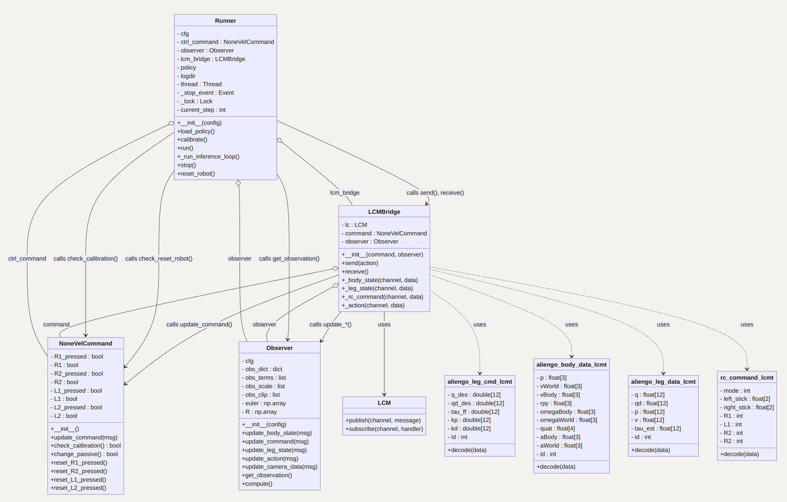

**NOTE: THE DEPLOYMENT PART IS NOT FINISHED.** Getting data from LiDAR or Realsense of Unitree and calibratoon of robot are not well implemented yet.--*2024.9.30*


# Overview
This project is a 'sim to real' pipeline for training a reinforcement learning agent to walk on a rough environment. The pipeline consists of simulation on **IsaacLab**, deploying the trained model on the real robot. The constructure diagram of deployment framework:




# System Requirements

**Simulation**: IsaacLab requires Isaac Sim platform. Check the system requirements and [Isaac Sim documentation](https://docs.omniverse.nvidia.com/isaacsim/latest/installation/install_workstation.html) for more information. The VRAM of NVIDIA GPU should be at least 8GB.

**Hardware**: This repository is tested on Unitree Aliengo robot. This robot can be purchased from [Unitree Robotics](https://www.unitree.com/aliengo/). A **LiDAR** sensor is also required for the whole pipeline to work.

## Container Installation

```bash
cd ./docker
make build
make run
```
`make build` will build the docker image called "deployment_controller" with IsaacLab and Isaac Sim, etc. `make run` will enter this container. 

```bash
cd ./learn/exts/locomotion
pip install -e .
```

## Local Installation

### Isaac Sim

Installing Isaac Sim through [Omniverse Launcher](https://docs.omniverse.nvidia.com/isaacsim/latest/installation/install_workstation.html) is recommended instead of building it from pip. This project uses Isaac Sim 4.2.0. After installation, set environment variables

```bash
# Isaac Sim root directory
export ISAACSIM_PATH="${HOME}/.local/share/ov/pkg/isaac-sim-4.2.0"
# Isaac Sim python executable
export ISAACSIM_PYTHON_EXE="${ISAACSIM_PATH}/python.sh"
```

By using commands below to check the installation of Isaac Sim:

```bash
# open a new empyu stage
${ISAACSIM_PATH}/isaac-sim.sh
# checks that python path is set correctly
${ISAACSIM_PYTHON_EXE} -c "print('Isaac Sim configuration is now complete.')"
# checks that Isaac Sim can be launched from python
${ISAACSIM_PYTHON_EXE} ${ISAACSIM_PATH}/standalone_examples/api/omni.isaac.core/add_cubes.py
```

### IsaacLab

IsaacLab is a new framework to replace Isaac Gym. It's developed based on Isaac Sim and provides a more flexible and powerful interface for training reinforcement learning agents.    

```bash
cd ~
git clone https://github.com/isaac-sim/IsaacLab.git
cd IsaacLab
# create a symbolic link
ln -s ~/.local/share/ov/pkg/isaac-sim-4.2.0 _isaac_sim
# create a virtual environment
./isaaclab.sh --conda <env_name>  # default name is 'isaaclab'
conda activate isaaclab
# install IsaacLab completely
./isaaclab.sh --install
```

verify the installation by running the following command:

```bash
./isaaclab.sh -p source/standalone/tutorials/00_sim/create_empty.py
# or
python source/standalone/tutorials/00_sim/create_empty.py
```
The above command should launch the simulator and display a window with a black ground plane.

> [!TIP]
>
> VSCode can be set up through [documentation](https://isaac-sim.github.io/IsaacLab/source/overview/developer-guide/vs_code.html).

# Training a Model

## Customize

setup package of locomotion

```bash
cd learn/exts/locomotion
pip install -e .
```

setup package of deploy

```bash
cd <root_dir>
pip install -e .
```

Configurations of Reinforcement Learning should be modified by users. It includes environment settings and agent settings. The env config locates in `./learn/exts/locomotion/locomotio/tasks/locomotion/velocity/config/<robot_name>/<env_cfg>`. 

**Env config** includes:

1. scene config
2. observation config
3. actions config
4. commands config
5. rewards config
6. terminations config
7. events config
8. curriculum config

**Agent config** includes

1. Algorithm: PPO
2. Policy: SAC
3. ...

`num_envs`, `num_iterations`, `ObsTerm` and many other parameters will be set in this config class. The next step is to register your task in file:`./learn/exts/locomotion/locomotio/tasks/locomotion/velocity/config/<robot_name>/__init__.py`. 

```bash
python learn/scripts/train.py --task Rough-Aliengo --num_envs 4096 --headless
python learn/scripts/play.py --task Rough-Aliengo --num_envs 1024
```

the output will be saved in `./runs/<task_name>/<data>`. Parameters like agent and env config are save in `params`.

# Deploying a Model

## Docker image and Container

Container is recommended for deploying this model. Firstly a docker image should be generated and moved into controlling board by running `make zip`. Put the repo in board and run `make unzip`, then run container

```bash
make run
```

## Unitree SDK

the sdk of unitree is mostly about LCM. And the data and command will be received and sent through LCM.

```bash
cd deploy/sdk 
mkdir build && cmake ..
make
# run lcm sdk
./aliengo_lcm
```

## Run deployment

```
conda activate isaaclab
cd deploy/scripts
python run_deploy.py
```

press R2 to make the robot calbirate.

with LiDAR’s data, the inference model should work well.

> [!IMPORTANT]
>
> coming soon
