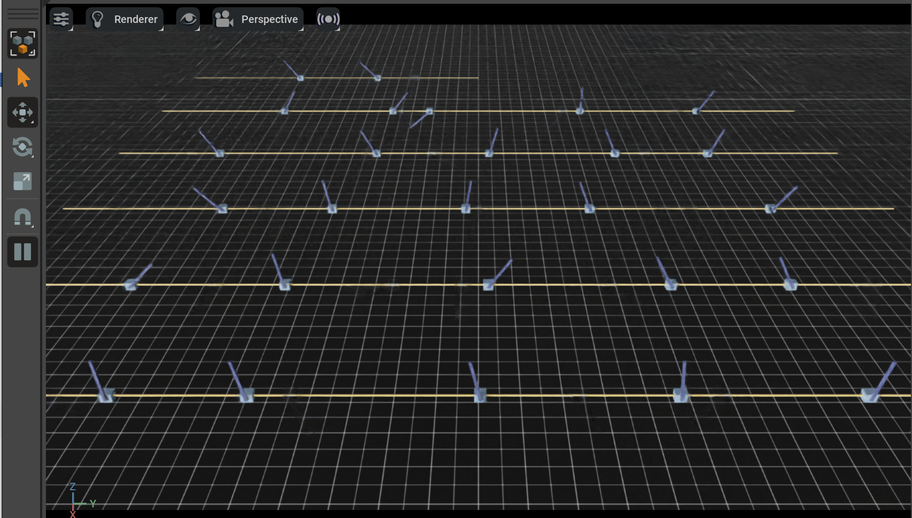

- [Simulation](#simulation)
  - [Docker Installation](#docker-installation)
  - [Local Installation](#local-installation)
    - [Omniverse Launcher](#omniverse-launcher)
    - [Pip](#pip)
    - [Verifying Installation](#verifying-installation)
  - [Train \& Play](#train--play)
- [Deployment](#deployment)
  - [Installation](#installation)
  - [Run](#run)


# Simulation

There are two ways to set up the work environment on your machine: one is via Docker installation, and the other is local installation. If you want to quickly use and deploy models, the Docker environment configuration is more recommended. First, you need to clone this repository:

```bash
git clone https://github.com/XMebius/isaaclab_sim_to_real.git
git clone https://github.com/isaac-sim/IsaacLab.git
cd isaaclab_sim_to_real
```

## Docker Installation

The Docker file in this repository is designed for model deployment. Although it also supports training, it does not have visualization. So here, we use Isaac Lab's container installation as a reference.

First, you need to install Docker:

```bash
# uninstall old packages
for pkg in docker.io docker-doc docker-compose docker-compose-v2 podman-docker containerd runc; do sudo apt-get remove $pkg; done

# Add Docker's official GPG key:
sudo apt-get update
sudo apt-get install ca-certificates curl
sudo install -m 0755 -d /etc/apt/keyrings
sudo curl -fsSL https://download.docker.com/linux/ubuntu/gpg -o /etc/apt/keyrings/docker.asc
sudo chmod a+r /etc/apt/keyrings/docker.asc

# Add the repository to Apt sources:
echo \
  "deb [arch=$(dpkg --print-architecture) signed-by=/etc/apt/keyrings/docker.asc] https://download.docker.com/linux/ubuntu \
  $(. /etc/os-release && echo "$VERSION_CODENAME") stable" | \
  sudo tee /etc/apt/sources.list.d/docker.list > /dev/null
sudo apt-get update

# install docker
sudo apt-get install docker-ce docker-ce-cli containerd.io docker-buildx-plugin docker-compose-plugin

# verify
sudo docker run hello-world
```

Then build the IsaacLab image and start running it. Since the base image for Isaac Lab is Isaac Sim, we can see the visualization effects of training and testing by setting up X11 forwarding.

```bash
cd IsaacLab/docker
# set x11_forwarding_enabled = 0 in file .container.cfg
python container.py start
python container.py enter base
```

Clone this repository inside the container, and from the root directory of `isaaclab_sim_to_real`:

```bash
pip install -e .
cd learn/exts/locomotion
pip install -e .
```

## Local Installation

Isaac Sim is the first thing you need to download and install. There are two download methods to download Isaac Sim: via Omniverse-launcher or pip. Using Omniverse-launcher to download Isaac Sim is recommended, as it will create a global environment variable, while pip can only be used in one Python environment. However, if there is no display device, pip is the only option.

### Omniverse Launcher

Submit your information on the [official website](https://www.nvidia.com/en-us/omniverse/download/) and download the omniverse-launcher-linux.AppImage file (note: not the SDK or toolkit).

```bash
sudo chmod +x omniverse-launcher-linux.AppImage
./omniverse-launcher-linux.AppImage
# or
./omniverse-launcher-linux.AppImage --appimage-extract # then run `AppRun`
```

During actual execution, I kept getting stuck at the login interface. Using `strace -f -e trace=network,file ./omniverse-launcher-linux.AppImage` revealed that the issue was with the FUSE library. At this point, consider re-downloading fuse2. However, I solved it by using the traditional method of extracting the directory with `./omniverse-launcher-linux.AppImage --appimage-extract`, then entering the extracted folder and directly running `AppRun`.

After entering the login interface, go to `EXCHANGE` and search for `Isaac Sim`.

Select Isaac Sim version **4.2.0**.

It takes about 290 seconds to open. During this time, you may see a `force quit` pop-up, which can be ignored. Just wait patiently.

### Pip

```bash
conda create -n isaac python=3.10 -y
conda activate isaac
pip install --upgrade pip
pip install isaacsim==4.2.0.0 --extra-index-url https://pypi.nvidia.com
pip install isaacsim-extscache-physics==4.2.0.0 isaacsim-extscache-kit==4.2.0.0 isaacsim-extscache-kit-sdk==4.2.0.0 --extra-index-url https://pypi.nvidia.com
```

### Verifying Installation
The default installation path is `${HOME}/.local/share/ov/pkg/isaac-sim-4.1.0`. Add two environment variables to your bashrc and auto-start the conda environment setup script.

```bash
export ISAACSIM_PATH="${HOME}/.local/share/ov/pkg/isaac-sim-4.1.0"
export ISAACSIM_PYTHON_EXE="${ISAACSIM_PATH}/python.sh"
source ${ISAACSIM_PATH}/setup_conda_env.sh
```

After running `source ~/.bashrc`, test the installation:

```bash
# open an empty sim window
${ISAACSIM_PATH}/isaac-sim.sh
# checks that the python path is set correctly
${ISAACSIM_PYTHON_EXE} -c "print('Isaac Sim configuration is now complete.')"
# checks that Isaac Sim can be launched from python
${ISAACSIM_PYTHON_EXE} ${ISAACSIM_PATH}/standalone_examples/api/omni.isaac.core/add_cubes.py
```

Next is the Isaac Lab installation, assuming Isaac Sim was installed using the Omniverse Launcher.

```bash
git clone https://github.com/isaac-sim/IsaacLab.git && cd IsaacLab
ln -s <path_to_isaac_sim> _isaac_sim
# for example ln -s ${HOME}/.local/share/ov/pkg/isaac-sim-4.2.0 _isaac_sim
./isaaclab.sh --install
```

> [!NOTE]
> VSCode Configuration
> Run the VSCode Task by pressing `Ctrl+Shift+P`, selecting `Tasks: Run Task`, and running `setup_python_env` from the dropdown menu. Successful execution will generate `launch.json` and `settings.json` files.
> 

To verify the installation:

```bash
./isaaclab.sh -p source/standalone/demos/quadrupeds.py
./isaaclab.sh -p source/standalone/demos/arms.py
```

The results obtained are as follows:


Next is environment testing, using zero-action agent and random-action agent.

```bash
./isaaclab.sh -p source/standalone/environments/zero_agent.py --task Isaac-Cartpole-v0 --num_envs 32
```
The effect is as follow:

 

Then test the state machine to see how the agent interacts with the environment in each independent state in the predefined finite state machine.

```bash
./isaaclab.sh -p source/standalone/environments/state_machine/lift_cube_sm.py --num_envs 32
```

The effects are as follows:


Next, test user teleoperation.

```bash
./isaaclab.sh -p source/standalone/environments/teleoperation/teleop_se3_agent.py --task Isaac-Lift-Cube-Franka-IK-Rel-v0 --num_envs 1 --teleop_device keyboard
```

The mapping table for each key and action is shown below:

```bash
Keyboard Controller for SE(3): Se3Keyboard
    Reset all commands: L
    Toggle gripper (open/close): K
    Move arm along x-axis: W/S
    Move arm along y-axis: A/D
    Move arm along z-axis: Q/E
    Rotate arm along x-axis: Z/X
    Rotate arm along y-axis: T/G
    Rotate arm along z-axis: C/V
```

The effect is as follows. At this point, you can control the end position movement of the robotic arm through the keyboard. This program also applies automatic IK calculation of joint angles.


## Train & Play

The default `locomotion_task` in this repository is called `Rough-Aliengo`.

```bash
python ./learn/scripts/train.py --task Rough-Aliengo --num_envs 4096
# headless mode
python ./learn/scripts/train.py --task Rough-Aliengo --num_envs 4096 --headless --video
```

Model files and corresponding parameter files will be saved in the `runs` directory under the root directory of `isaaclab_sim_to_real`, with a structure like `./runs/<env_name>/<time>/`. The configuration parameters of the agent are saved in `params/agent.pkl` or `params/agent.yaml` files. The configuration parameters of the environment are saved in `params/env.pkl` or `params/env.yaml`.

```bash
python ./learn/scripts/play.py --task Rough-Aliengo --num_envs 1024 --video --video_length 1000
```

# Deployment

## Installation

Running in container is recommended for deployment. Firstly zip the image and send it to unitree dog's controlling board. Before running the commands below, please check that you have connected the local network of controlling board.

```bash
cd deploy/docker
make zip
```

After logining to the console of PC, clone the repo to your workspace

```bash
make unzip
make run
```

## Run

To communicate with the control program of the robot dog, we need to run the SDK files for the robot dog. Enter the `deploy/sdk` directory:

```bash
mkdir build && cmake ..
make
```

Run the compiled files. At this point, the robot dog will lock into its current posture. If you try to move the robot dog’s joints, you will feel noticeable resistance.

Next, run the control program:

```bash
python scripts/run_deploy.py
```

Note that both of the above commands are executed within the container.

When the control program starts running, the robot dog will first prepare to enter calibration mode, which will cause the robot to stand up automatically. After you press R2, the robot will begin calibration. Once the robot is standing, you can press L2 to start the reinforcement learning control mode.
